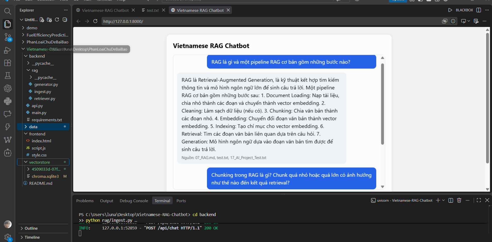

Vietnamese RAG Chatbot

Chatbot hỏi-đáp tài liệu tiếng Việt sử dụng kiến trúc RAG (Retrieval-Augmented Generation), chạy hoàn toàn local — không cần API key và không phụ thuộc vào dịch vụ bên thứ ba.

Demo

Tính năng
Nạp tài liệu từ file .docx, .txt, .md
Tìm kiếm ngữ nghĩa (semantic search) bằng vector embedding đa ngôn ngữ
Sinh câu trả lời dựa trên ngữ cảnh được truy xuất
Sử dụng LLM local thông qua Ollama
Không gửi dữ liệu tài liệu lên dịch vụ bên ngoài
Giao diện web đơn giản để hỏi đáp trực tiếp
Kiến trúc
Người dùng đặt câu hỏi
        │
        ▼
   [Retriever]
        │
        │ Tìm các đoạn văn bản liên quan
        ▼
  [Vector Store]
        │
        ▼
   [Generator]
        │
        │ Context + Question
        ▼
   [Local LLM]
     (Ollama)
        │
        ▼
    Câu trả lời

Pipeline gồm 2 giai đoạn:

1. Ingest

backend/rag/ingest.py

Documents
    ↓
Document Loader
    ↓
Chunking
    ↓
Embedding
    ↓
ChromaDB

Đọc tài liệu → chia nhỏ thành các đoạn → tạo vector embedding → lưu vào ChromaDB.

2. Query

backend/rag/retriever.py + backend/rag/generator.py

Question
    ↓
Embedding
    ↓
Vector Search
    ↓
Relevant Context
    ↓
LLM
    ↓
Answer

Tìm các đoạn tài liệu liên quan nhất → kết hợp context với câu hỏi → gửi cho LLM local để sinh câu trả lời.

Công nghệ sử dụng
Thành phần	Công nghệ
Language	Python
Embedding	sentence-transformers
Embedding Model	multilingual-e5-base
Vector Store	ChromaDB
LLM	Ollama
LLM Models	Qwen2.5 / Llama
Backend	Python
Frontend	HTML, CSS, JavaScript
Cấu trúc thư mục
Vietnamese-RAG-Chatbot/
│
├── backend/
│   ├── main.py
│   ├── rag/
│   │   ├── ingest.py
│   │   ├── retriever.py
│   │   └── generator.py
│   ├── models/
│   └── requirements.txt
│
├── frontend/
│   ├── index.html
│   ├── style.css
│   └── script.js
│
├── data/
│   └── documents/
│       └── # Tài liệu nguồn (.docx, .txt, .md)
│
├── vectorstore/
│   └── # Vector database được tạo sau khi ingest
│
├── .env.example
├── .gitignore
└── README.md

Lưu ý: Không nên commit .env chứa thông tin nhạy cảm lên GitHub. Nếu project không cần biến môi trường thì có thể bỏ .env và .env.example.

Cài đặt
1. Cài đặt Ollama

Cài Ollama, sau đó tải model:

ollama pull qwen2.5:7b

Kiểm tra model:

ollama list
2. Tạo môi trường Python
python -m venv venv

Windows:

venv\Scripts\activate

Linux / macOS:

source venv/bin/activate
3. Cài đặt dependencies
pip install -r backend/requirements.txt
4. Thêm tài liệu

Đặt các file .docx, .txt hoặc .md vào:

data/documents/

Ví dụ:

data/documents/
├── quy_che_dao_tao.docx
├── huong_dan_sinh_vien.pdf
└── noi_quy.md

Nếu code hiện tại chưa hỗ trợ PDF thì không nên ghi .pdf ở đây.

Sử dụng
1. Ingest tài liệu

Chạy:

python backend/rag/ingest.py

Quá trình này sẽ đọc tài liệu, chunk dữ liệu, tạo embeddings và lưu vào ChromaDB.

2. Chạy chatbot
python backend/main.py

Sau đó mở địa chỉ web được hiển thị trong terminal, ví dụ:

http://127.0.0.1:5000
Hướng phát triển
 Hỗ trợ thêm PDF
 Cải thiện xử lý tiếng Việt và word segmentation
 Kết hợp BM25 với vector search (Hybrid Search)
 Thêm Cross-Encoder Re-ranking
 Xây dựng bộ câu hỏi đánh giá RAG
 Đánh giá Recall@K và MRR
 Thêm citation/source cho câu trả lời
 Đóng gói API bằng FastAPI
 Dockerize toàn bộ hệ thống
 Cải thiện giao diện chat